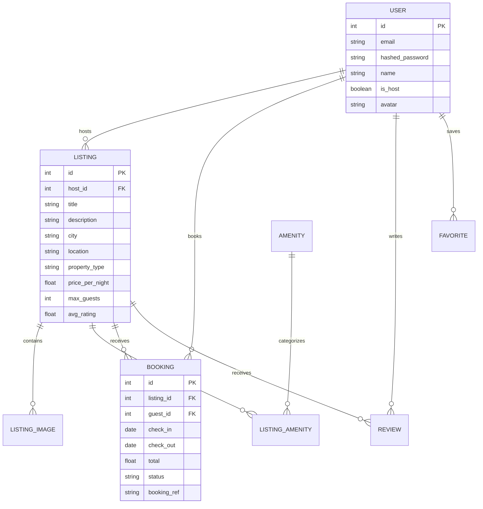

# Staybnb – Full-Stack Vacation Rental Marketplace

A full-stack Staybnb vacation-rental marketplace built with Next.js 16 (React 19, TypeScript, Tailwind CSS), FastAPI (Python 3.12, SQLAlchemy, Pydantic), and SQLite/PostgreSQL. Includes a custom design system, sectioned carousels, category search, interactive map view, booking pipeline, host dashboard, and review system.

---

## Architecture Overview

```
Browser (React 19 / Next.js App Router)
   │
   ├─► REST API Calls (Fetch API with fallback state)
   │
   ▼
FastAPI Backend (Python 3.12 + Pydantic v2)
   │
   ├─► SQLAlchemy ORM Engine
   │
   ▼
SQLite Database (airbnb.db / PostgreSQL in Prod)
```

---

## Key Features

### 1. Visual & UX Fidelity
* **Staybnb Design System**: Crafted with precise typography, card aspect ratios, badge pills, and sticky widgets.
* **Top Navigation Bar**: Category switcher tabs (`All`, `Homes`, `Experiences`, `Services`), currency selector, language selector, and user account modal.
* **Sectioned Listing Carousels**: Dedicated homepage rows for "Popular homes in South Goa" and "Available next month in North Goa" with stacked "See all" card.
* **Hero Search Bar**: Floating search pill supporting location search, date pickers, guest selectors, and price range filters.
* **Floating Pricing Tag**: Sticky button (`Prices include all fees`) at the bottom of the viewport.

### 2. Core Marketplace Functionality
* **Search & Filter Engine**: Client-side & server-side filtering by city, location, property type, price range (min/max), star rating, and guest capacity.
* **Listing Detail Page**: Photo gallery modal, host highlights, Superhost badge, amenity breakdown, interactive location map, review breakdown, and sticky booking card.
* **Booking & Overlap Prevention**: Date range validation checking availability against existing bookings.
* **Mock Payment & Checkout**: Multi-step checkout with mock card validation and instant confirmation generation (`HMB...` booking references).
* **My Trips**: Dedicated guest dashboard tracking upcoming, past, and cancelled reservations.
* **Host Dashboard & CRUD**: Create, edit, and delete listings with sample photo presets, image previews, and booking management.
* **Favorites / Wishlist**: Heart button toggling user saved listings.

### 3. Bonus Features
1. **Interactive Map View**: Styled Leaflet/SVG map container with custom listing price pins and preview popups on Search & Detail pages.
2. **Superhost Badge**: Official medal/star badge for top-rated hosts (rating ≥ 4.8).
3. **Review Submission & Rating Aggregation**: Multi-category ratings (Cleanliness, Accuracy, Communication, Location, Value) on stays.
4. **Image Upload & Preview Grid**: Drag-and-drop / preset selection for host listing management.
5. **Dark Mode Toggle**: Built-in light/dark theme switcher in the Navbar user menu.

---

## Tech Stack

| Layer | Technology |
|---|---|
| **Frontend Framework** | Next.js 16 (App Router, Turbopack) |
| **UI Library & Icons** | React 19, Tailwind CSS v4, Lucide React |
| **State & Fetching** | React Context, Native Fetch API with mock fallback resilience |
| **Backend Framework** | FastAPI (Python 3.12), Uvicorn |
| **ORM & Database** | SQLAlchemy 2.0, SQLite (`airbnb.db`), Pydantic v2 |
| **Authentication** | JWT (JSON Web Tokens) with Passlib & Bcrypt |

---

## Folder Structure

```
airbnb/
├── frontend/
│   ├── src/
│   │   ├── app/
│   │   │   ├── page.tsx               # Homepage with sectioned carousels
│   │   │   ├── layout.tsx             # Root layout with Navbar & Footer
│   │   │   ├── search/page.tsx        # Search page with filter & map toggle
│   │   │   ├── listings/[id]/page.tsx # Listing detail page
│   │   │   ├── checkout/[id]/page.tsx # Confirm & Pay page
│   │   │   ├── booking/[id]/confirmation/page.tsx # Confirmation receipt
│   │   │   ├── trips/page.tsx         # Guest trips dashboard
│   │   │   ├── favorites/page.tsx     # Saved wishlist
│   │   │   └── host/                  # Host dashboard, create & edit listing
│   │   ├── components/
│   │   │   ├── layout/                # Navbar, Footer, AuthModal
│   │   │   ├── listings/              # ListingCard, ListingGrid, FavoriteButton, ReviewForm
│   │   │   ├── search/                # SearchBar, CategoryBar, FilterModal, DateRangePicker
│   │   │   ├── map/                   # ListingMap (interactive map pins)
│   │   │   └── ui/                    # SuperhostBadge, Modal, Toast, Rating, LoadingSkeleton
│   │   ├── lib/                       # API client (`api.ts`), mock data (`mockData.ts`), utils (`utils.ts`)
│   │   └── types/                     # TypeScript definitions
├── backend/
│   ├── app/
│   │   ├── database.py                # SQLAlchemy engine & SessionLocal
│   │   ├── main.py                    # FastAPI application initialization & CORS
│   │   ├── models/models.py           # SQLAlchemy database tables & relationships
│   │   ├── schemas/schemas.py         # Pydantic request/response validation
│   │   └── routers/                   # API routers (listings, bookings, reviews, host, auth)
│   ├── seed.py                        # Database seed script
│   └── requirements.txt               # Python backend dependencies
└── README.md                          # Project documentation
```

---

## Database Schema & Relationships



---

## API Endpoints Reference

### Public & Search Endpoints
- `GET /api/listings`: Fetch listings with filters (`location`, `property_type`, `min_price`, `max_price`, `min_rating`, `guests`).
- `GET /api/listings/{id}`: Fetch single listing detail.
- `GET /api/listings/{id}/availability`: Check booked date ranges and fee rates.
- `GET /api/listings/{id}/reviews`: Fetch listing reviews and aggregated category scores.

### Booking & Checkout
- `POST /api/bookings`: Create a new booking reservation (validates date overlaps).
- `GET /api/bookings/my`: Fetch current guest's bookings.
- `GET /api/bookings/{id}`: Fetch booking receipt details.
- `PATCH /api/bookings/{id}/cancel`: Cancel an active booking.

### Host Endpoints
- `GET /api/host/listings`: Fetch listings owned by host.
- `POST /api/listings`: Create new listing.
- `PUT /api/listings/{id}`: Edit existing listing (ownership enforced).
- `DELETE /api/listings/{id}`: Remove listing (ownership enforced).
- `GET /api/host/stats`: Aggregate host earnings, total bookings, and ratings.

---

## Price & Fee Calculation Logic

$$\text{Subtotal} = \text{Nightly Price} \times \text{Nights}$$

$$\text{Cleaning Fee} = \text{Round}(\text{Nightly Price} \times 0.10)$$

$$\text{Service Fee} = \text{Round}(\text{Subtotal} \times 0.10)$$

$$\text{Total Price} = \text{Subtotal} + \text{Cleaning Fee} + \text{Service Fee}$$

---

## Local Setup Instructions

### Prerequisites
- Node.js (v18.0.0 or higher) & npm
- Python (v3.10 or higher)

### 1. Frontend Setup
```bash
cd frontend
npm install
npm run dev
```
The frontend will run at `http://localhost:3000`.

### 2. Backend Setup
```bash
cd backend
python -m venv venv
source venv/bin/activate # On Windows: venv\Scripts\activate
pip install -r requirements.txt
python seed.py          # Seed SQLite database with sample hosts & listings
uvicorn app.main:app --reload --port 8000
```
The FastAPI backend will run at `http://localhost:8000`. API docs available at `http://localhost:8000/docs`.

---

## Deployment Guide

### Frontend Deployment (Vercel)
1. Import the `frontend` folder into Vercel.
2. Set Environment Variable:
   ```env
   NEXT_PUBLIC_API_URL=https://your-backend-api.onrender.com
   ```
3. Deploy!

### Backend Deployment (Render / Railway)
1. Push `backend` folder to GitHub.
2. Create a Python Web Service on Render or Railway.
3. Build Command:
   ```bash
   pip install -r requirements.txt && python seed.py
   ```
4. Start Command:
   ```bash
   uvicorn app.main:app --host 0.0.0.0 --port $PORT
   ```
5. Set `CORS_ORIGINS` to allow your Vercel frontend domain.

---

## Assumptions & Future Enhancements

- **Mock Payment**: Payments simulate successful credit card processing without requiring real Stripe keys.
- **Resilience**: The frontend includes automatic client-side fallback data so that all pages render smoothly even if the backend service is offline.
- **Future Enhancements**: Real-time messaging between guests and hosts via WebSockets, multi-currency conversion, and Google OAuth SSO integration.
